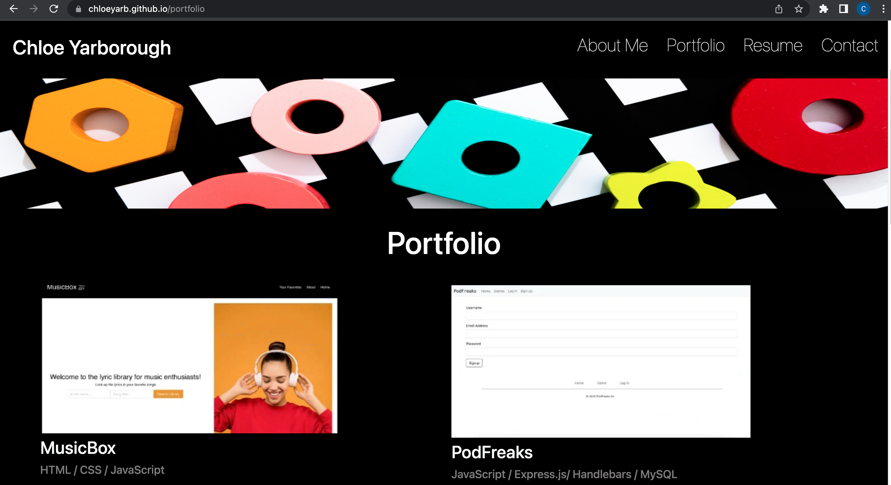

# Chloe's Portfolio

<h1 align="center">Portfolio</h1>

## Table of Contents

* [Description](#description)
* [BuiltWith](#built-with)
* [Installation](#installation) 
* [Deployed Application](#deployed-application)
* [Contributor](#contributor)

## Description

This portfolio serves as a showcase of some my work. In this portfolio application the visitor can view my projects, contact me, and see my resume. 
Feel free to take a peak and get to know a little bit about me!    

## Built With

* Javascript
* React/ React Router
* Bootstrap
* CSS

## Installation

1. Run `npx create-react-app <name-of-your-app>` from root directory to create react app and release React.

3. Run `npm start` in the root directory. The React browser will open to view application.

## Deployed Application

[GitHub Pages](https://chloeyarb.github.io/chloe-portfolio/)

</img>

## GitHub Repository

[Chloe's Portfolio](https://github.com/chloeyarb/chloe-portfolio)

## Contributor

Chloe Yarborough

Connect with me on [GitHub](https://github.com/chloeyarb)!
